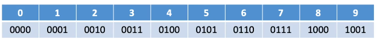
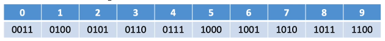

### BCD码出现由来

为了方便计算机处理，符合人类习惯，处理转换麻烦的问题

BCD: Binary-Coded Decimal

用4个二进制位来表示一个10进制位

----------------
### 8421码

8421码的映射关系 (权值固定，有权码)



```
5: 0101
8: 1000

5 + 8 = 1101 (不在8421码的表示区间里, 则进行+6操作)

1101 + 6 =  1101 + 0110 = 0001 0011 = 13
	（4个二进制位表示16，有10个在映射范围内）
```

若加法运算的结果在合理的范围内，则无需对结果进行修正

-----------------
### 余3码

余3码: 8421码 + 0011 （二进制位权值不固定，无权码）




-----------------
### 2421码

2421码：改变权值定义


2421码的 0-4 的开头都是0，5-9的开头都是1，避免歧义

(如: 5: 可以表示为0101，1011，有上述限制之后只能表示为1011)
