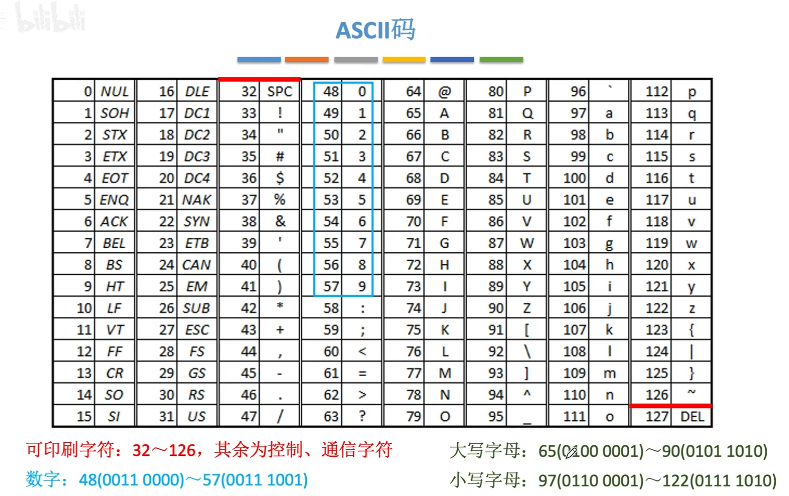
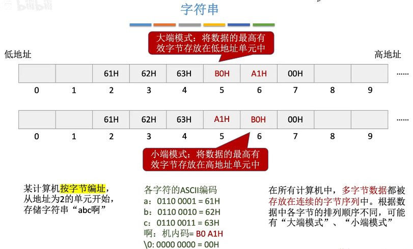

### ASCII 码

- 可印刷字符: 32-126, 其余为控制，通信字符
- 数字字符: 48(0011 0000) \~ 57(0011 1001)
	
	前都是0011, 后面则是相应数字的8421码

- 大写字母: 65 (0100 0001) \~ 90 (0101 1010)
	
	前3个比特位都是 010，后5个比特位正好是 1-26

- 小写字母: 97 (0110 0001) \~ 122(0111 1010)

	前3个比特位都是 011，后5个比特位正好是 1-26

### 汉字的表示和编码

GB 2312-80: 汉字和各种符号共7445个

#### 区位码

94个区，每个区94个位置，每个区的取值范围是[0,93]，每个位置的取值范围是[0,93]

比如: **“啊”** 的区位码为1601，则在表示为二进制的时候, 有可能某个码处在ASCII码的0-31的范围内，此范围内的ASCII代表控制/通信字符，可能出现未知的错误，所以我们在二进制码的基础上加32(十六进制为20H)，得到国标码

#### 国标码

区位码 + 2020H

可表示[32, 125]的范围，处在ASCII码的英文范围，如果要兼容ASCII码，则需要在每一部分的8421码上加上128（80H），则到汉字内码。

#### 汉字内码

国标码 + 8080H

所以汉字的每一部分的编码都是大于128的

#### 输入编码和字形编码

输入编码: 如“内”, 输入 输入法，'nei'

字形编码: 

#### 字符串

从低地址到高地址逐个字符存储，常采用'\0'作为结尾标志

