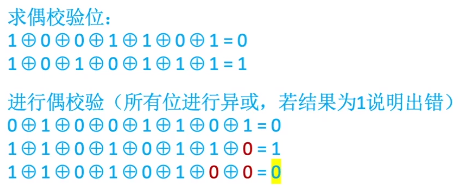
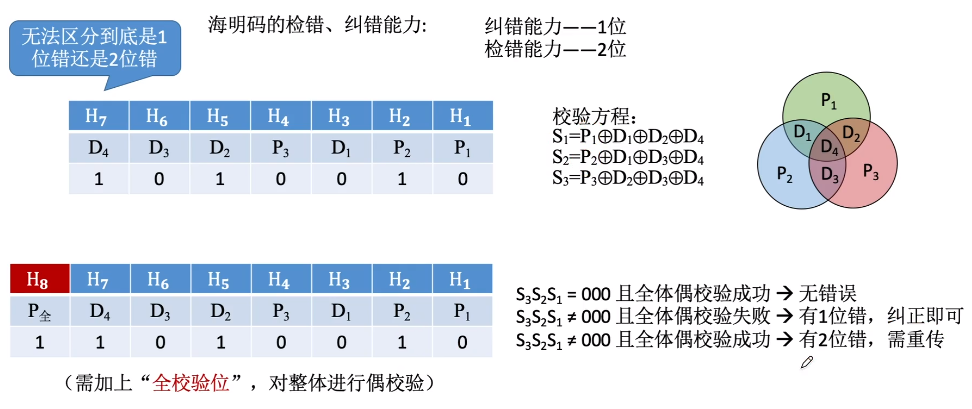
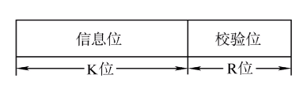

计算机内部数据有可能发生错误

### 校验原理

| 2bit 映射到4个合法状态| | | |  |
| ----- | ---- | --- | --- | --- |
| 信息  | A    | B   | C   | D   |
| 编码  | 00   | 01  | 10  | 11  |

| 3bit 映射到4个合法状态 | | | | |
| ----- | --- | --- | --- | --- |
| 信息 | A | B | C | D |
| 编码 | 100 | 001 | 010 | 111 |

2bit映射的编码如果在传输过程中，发生了某一个bit位的跳变，就会由某一个合法编码跳转到另外一种合法编码，如 00在传输过程中变成了01，则接收编码的计算机就误以为传输方传输的是'B', 实际上传输方传输的是'A', 则发生了错误。

3bit映射的编码，设计位任意两个bit位的编码都不同，则传输过程中发生了某一个bit位的跳变，传输的信息就会由一个合法的编码变成一个非法的编码，从而避免了错误。

--------------
一些相关的概念:

#### 码字

由若干位代码组成的一个字叫码字，就是上述的编码

#### 两个码字之间的距离

将两个码字逐位进行对比，具有不同的位的个数

#### 码距

一种编码方案可能有若干个合法码字，各合法码字间的最小距离

上述2bit 映射的码字的码距为 d = 1, 3bit 映射的码字的码距为 d = 2

当 d = 1时，无检错能力; 当 d = 2时，有检错能力; 当 d >= 3时，若设计合理，可能具有检错，纠错能力。

### 奇偶校验码

#### 奇校验码

整个校验码(有效信息位和校验位) 中'1'的个数为奇数

#### 偶校验码

整个校验码(有效信息位和校验位) 中'1'的个数为偶数

-----------------------------------
!!! question
	给出两个编码 1001101 和 1010111的奇校验码和偶校验码
	设最高位为校验位，余7位是信息位，则对应的奇偶校验码为 ？
!!!answer
	奇校验: 1 10011101    0 1010111    
	偶校验: 0 10011101    1 1010111

如果发生一位跳位，则通过奇偶校验码能校验出来，如果有两位，则无法检测出是否正确

#### 偶校验码的硬件实现

各信息进行异或运算，得到的结果即为偶校验码

#### 进行偶校验

所有位进行异或，若结果为1说明出错

### 海明码

#### 设计思路

将信息位分组进行奇偶校验

#### 需要多少个校验位

信息位为n, 校验位k, 信息位+校验位共 n+k 位, n+k位任何一位都可能出错, 再加1种正确状态

2^k 种状态，所以k 满足 2^k >= n+k+1;

#### 确定校验位的分布

校验位Pi放在海明位号为2^i-1的位置上

#### 海明码的检错纠错能力

纠错能力-----1位

检错能力-----2位

### 循环冗余校验码

Cycle Redundancy Check

#### 基本思想

数据发送，接收方预定一个”除数“

K个信息位和R个校验位作为”被除数“, 添加校验码后需保证除法的余数为0

#### 例题

产生余数的具体过程为: 

101001000 除数的二进制码1101 进行模2除法

最后得到的001就是校验码

#### 纠错检错能力

