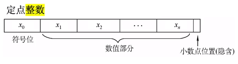
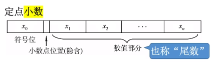

### 定点数

小数点位置固定

#### 无符号数

整个机器字长的全部二进制位均为数值位，没有符号位

n位无符号数的可表示范围为0\~2^n-1

#### 有符号数

n位有符号数的可表示范围为-(2^n - 1) \~ 2^n-1

#### 定点整数

若机器字长为8，则 +19D可表示为 0,0010011

#### 定点小数

若机器字长为8，则 -0.75D可表示为 1,1100000

 