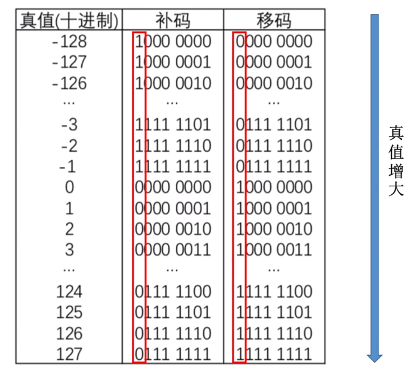

### 概念

#### 原码

符号位 + 真值的绝对值

#### 反码

正数的反码和原码一致

负数的反码为符号位不变，其余各位取反

#### 补码

正数的补码和原码一致

负数的补码为原码的符号位不变，其余各位取反 + 1，也就是反码 + 1

**为什么会有补码???**

计算机在处理加法的时候，通过原码就能达到这个目的。

假如机器字长为8位
```
8 + 4
	00001000
   +00000100
	---------
	00001100  (12D) 正确运算
```
```
8 - 4
	00001000
   -00000100
	---------
    00000100 （4D）正确运算
```
能不能用加法代替减法，从而在硬件层面可以少设计一个减法器呢?

```
8 + (-4)
	00001000
   +10000100
   ----------
    10001100 （-12D）运算错误
```

所以科学家们想了一个办法，(-4 mod 2^8)的结果和 (-4+2^8 mod 2^8) 的结果是一致的，数论中同余的概念，(-4+2^8) 为-4的补数。 

a的补数 = 模 - (a的绝对值)

#### 移码

补码符号位取反。

**移码的定义**

移码 = 真值 + 偏置值  
8位的移码的偏置值=128D = 1000 0000B, 即2^n-1

移码的应用:

移码表示的整数可以很方便比对大小，只要从二进制的最高位依此比对，移码是随着真值增大而增大的




