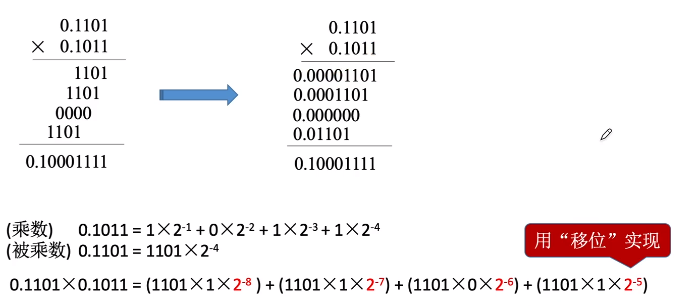
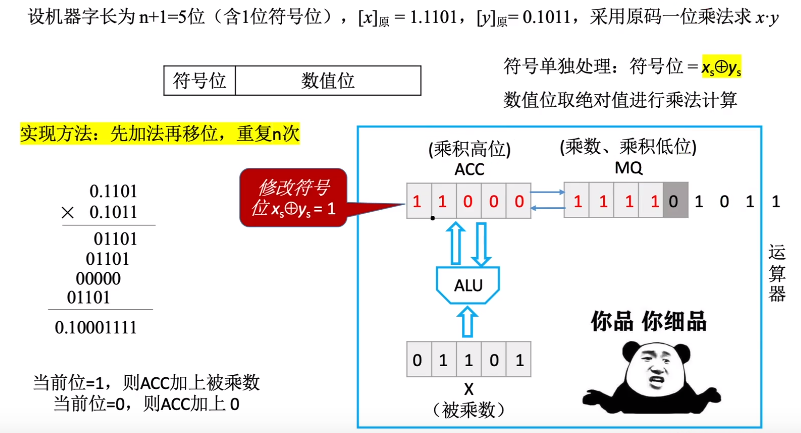

十进制乘法:

二进制乘法:

### 原码一位乘法

机器实现原码一位乘法

一位乘法原理:

1. 符号位 = 被乘数符号位 ^ 乘数符号位
2. ACC (累加器)先初始化为0，用来保存乘积高位
3. MQ (乘商寄存器), 用来保存乘数，乘积地位
4. X (通用寄存器), 用来保存被乘数
5. ALU (算术逻辑单元), 用来实现加法运算
6. 每次运算从MQ种取出乘数的最低位，当最低位为1时，ALU将X中的被乘数和ACC中暂存的结果做累加，加完之后放回ACC，MQ中的乘数逻辑右移一位，继续重复第6步，重复n次，n为数值位的长度。

### 补码一位乘法

### 原码补码乘法比较

