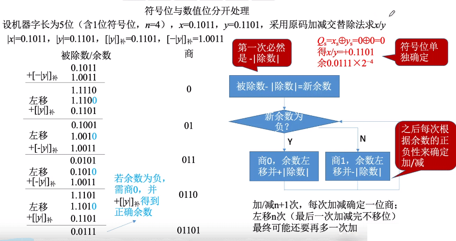
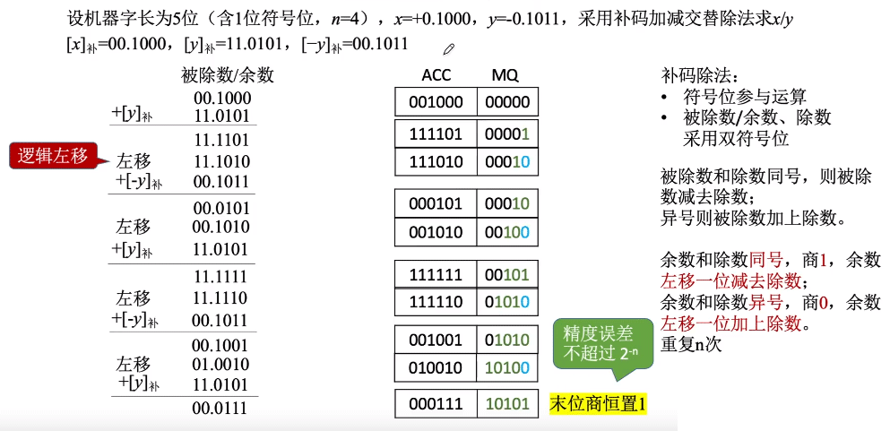

十进制除法

二进制除法

### 恢复余数法

符号位和乘法类型，符号位取异或的值

下面的除数，被除数都是绝对值的形式

核心: CPU默认商1，余数加上除数相反数求余，如果为负，则原本需要商0，余数再加回除数，恢复余数

### 加减交替法

不恢复余数法

核心思想: 在恢复余数法中进行改进，若余数为负，则可直接商0，并让余数左移1位再加上除数

### 补码的除法

补码的加减交替法

