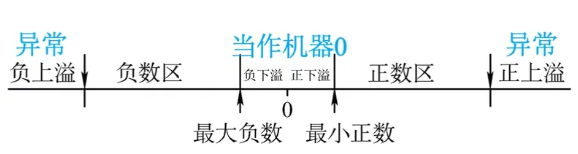
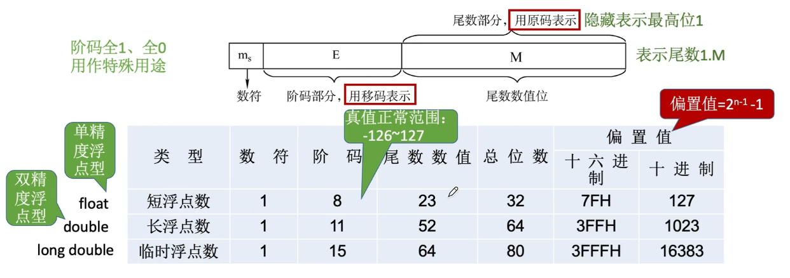
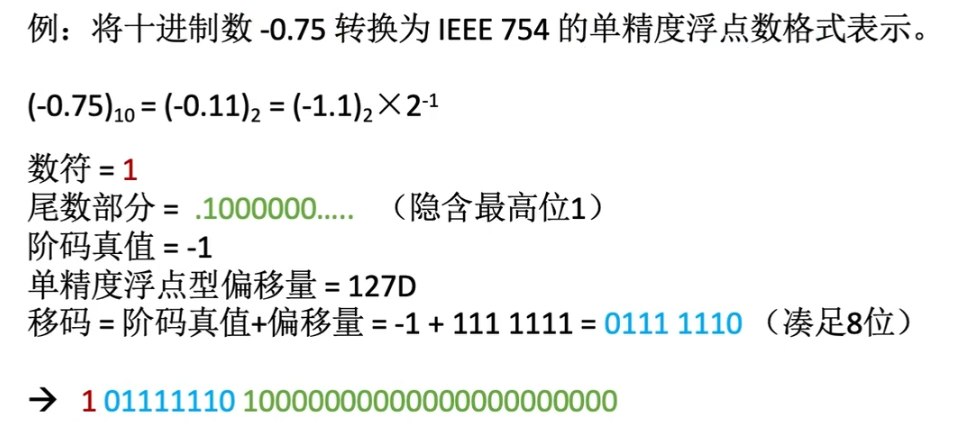

### 定点数的局限性

定点数可表示的数字范围有限，但我们不能无限制的增加数据的长度

如何在位数不变的情况下增加数据的表示范围

### 从科学计数法理解浮点数

普通计数法: +302657264526

科学计数法: +3.026 * 10^11

10^11 中的10是固定不变的，所以我们可以把10省略不记录，把原来的数记成如下的形式+11+3.026

其中+11为阶码部分，+3.026为尾数部分

#### 浮点数表示

浮点数的真值: N = r^E + M

r: 阶码的底, 通常为2，也可以为4，8，16等    
E: 阶码, 表示浮点数的 **表示范围** ，小数点的实际位置    
M: 尾数，数值部分的位数及反映浮点数的精度     

例: 阶码，尾数均用补码表示，求a, b的真值

a = 0,01;1.1001   
b = 0,10;0.01001

a的阶码部分, +1     
a的尾数部分的原码, 1.0111     
所以a的真值为 -0.111  （算术左移一位）
用一个字节来存储的话，正好可以表示为 001 11001

b的阶码部分, +2     
b的尾数部分的原码, 0.01001  
所以b的真值为 +1.001  (算术左移两位)  
**用一个字节来存储的话，010 00100 (最后的一个1被抛弃了，产生了精度丢失)**

#### 浮点数尾数规格化

由上例可知，浮点数尾数太长，存储容量不变的情况下，就会产生精度丢失。  
怎么避免精度丢失呢??  

如果尾数部分只能由四位构成:   
+302657265426 = +3.026 * 10^+11  
可记为: +11+3.026  
也可记为: +14+0.003  

由此可知，如果尾数的最高位是无效值，会丢失精度，所以科学计数法的尾数部分的最高位不能为0

同理上述的b可这么表示

**注: 采用“双符号位，当溢出发生时，可以挽救，更高的符号位是正确的符号位”**

#### 浮点数的表示范围

### IEEE 745

浮点数的表示，阶码和尾数占用的尾数不固定，计算机之间难以交互，所以出现了IEEE 745标准

#### 例题

#### 阶码全0，全1的特殊用途

