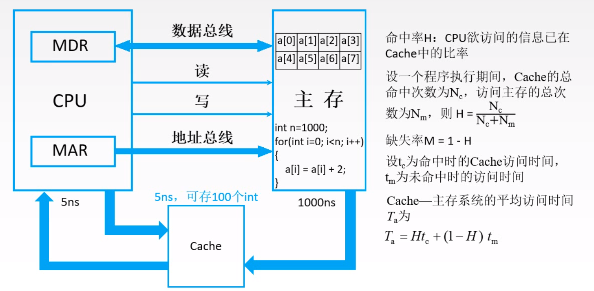
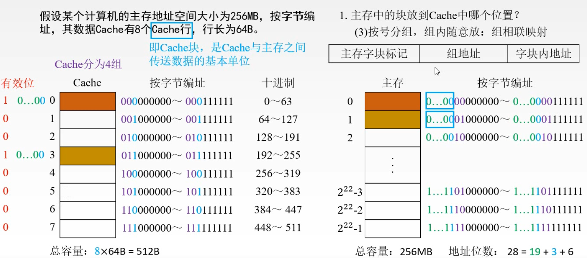

### 局部性原理

局部性原理的产生: 主存和cpu的速度差距过多，如何提升主存的速度，一种提升主存的接口数量和主存模块的数量，但是这样主存的速度还是太慢，并且价格昂贵，后来人们发现了程序访问的局部性原理，cpu访问主存实际上只是访问存储器的一小块地方，只需要将那一小块地方进行改善。

存在一种速度很快，造价相对较贵，但是存储容量教主存小的Cache，来弥补主存和CPU的速度不匹配的问题

Cache 虽然存储容量不大，但是相对于寄存器，容量还是较大的，所以CPU和Cache交互是以字节来算的，主存和Cache交互是以块来算的。

#### 空间局部性

在最近的未来要用到的信息(指令和数据), 很可能与现在正在使用的存储空间上是邻近的

#### 时间局部性

在最近的未来要用到的信息，很可能是现在正在使用到的信息

### Cache命中率

### Cache基本工作原理

#### 地址映射

主存中的块放到Cache中哪个位置

##### 全相联映射

主存中的块随意的放到Cache中，需要在Cache地址中高位保存主存的地址的高位。

##### 直接映射

主存中的块直接映射到Cache中

##### 组相联映射

按编号，组内随意放。

##### 总结

全相联映射，Cache随意被放，提高了空闲空间的利用率，但是杂乱无章   
直接映射，某种地址只能放在固定的Cache中，即使Cache中存在空闲的空间，也不能放，空间利用率低，但是查找方便   
组相联映射，前两种方案的折中，组内随意放，分组保证了存取的有序，随意放提高了空间的利用率

### Cache满了如何处理

#### 随机算法

随机地确定替换的Cache块。 它的实现比较简单，但没有依据程序的局部性原理，故可能命中率较低。

#### 先进先出算法(FIFO)

选择最早调入的行进行替换，比较容易实现，但也没有依据程序访问的局部性原理，可能会把一些需要经常使用的程序块(如循环程序)也作为最早进入的Cache的块替换掉。

#### 近期最少使用算法(LRU)

依据程序访问的局部性原理选择近期内长久未访问过的存储行作为替换的行，平均命中率要比FIFO高，是堆栈类算法

LRU算法对每行设置一个计数器，Cache每命中一次，命中行计数器清零，而其他各行计数器均+1，需要替换时比较特定行的计数值，将计数值最大的行换出

#### 最不经常使用算法(LFU)

将一段时间内被访问次数最少的存储行换出。 每行也设置一个计数器，新行建立后从0开始计数，每访问一次，被访问的行计数器+1，需要替换时比较各特定行的计数值，将计数值最小的行换出

### 写策略

当Cache中的数据被CPU改写时，怎样保证主存中的数据也同步改写

全写法: 当Cache中的数据被修改时，直接写回主存，不过一般会使用一个write buffer; 当CPU修改Cache过多，可能造成buffer溢出   
写回法: Cache存储体中用一位“脏位”标记该字块是否需要写回主存，当该块数据被替换时，根据脏位判断直接替换还是写回主存;

-------
当CPU未命中Cache时，需要修改数据。

写分配法: 把主存中的块调入Cache，在Cache中修改，搭配写回法使用。  
非写分配法: 只写入主存，不调入Cache，搭配全写法使用
