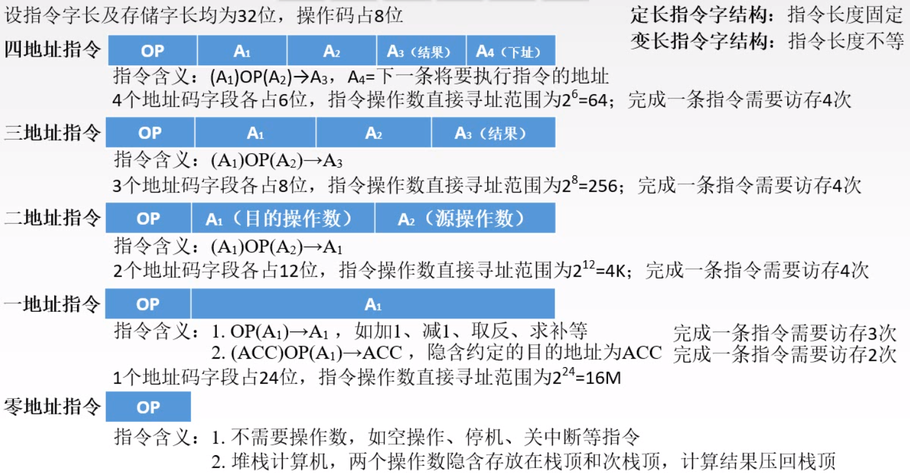
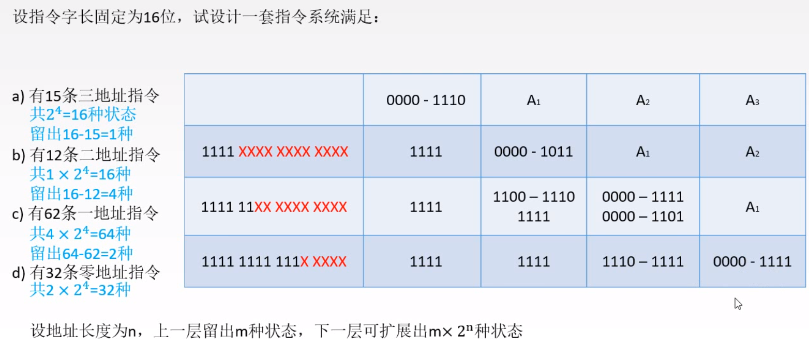

### 指令格式

如何用二进制代码表示指令

一条指令就是机器语言的一个语句，它是一组有意义的二进制代码;

包含 <strong>操作码</strong>和 <strong>地址码</strong>	

操作码: 指出指令的功能   
地址码: 给出被操作的信息(操作数)的地址

#### 地址码的设计

#### 操作码的设计

##### 定长操作码

在指令字的最高位分配固定的若干位表示操作码

一般n位的操作码字段的指令系统最大能够表示2^n条指令

优点: 定长操作码对于简化计算机硬件设计，提高指令译码和识别速度很有利  
缺点: 指令数量增加时会占用更多的固定位，留给表示操作数地址的位数受限。

##### 扩展操作码

全部指令的操作码字段的位数不固定，且分散地放在指令字的不同位置上

最常见的变长操作码的方法是扩展操作码，使操作码的长度随地址码的减少而增加，不同地址数的指令可以具有不同长度的操作码，从而在满足需要的前提下，有效的缩短指令字长。

优点: 在指令字长有限的前提下仍保持比较丰富的指令种类   
缺点: 增加了指令译码和分析的难度，使控制器的设计复杂化。

##### 操作类型

--------------------------
### 指令寻址方式

给出下一条指令的地址

给出要操作对象的地址

#### 指令寻址

下一条欲执行指令的指令地址 （始终由程序计数器PC给出）

##### 顺序寻址

(PC) + 1 ---> PC

##### 跳跃寻址

由转移指令指出，由转移指令修改PC

#### 数据寻址

确定本条指令的操作数地址

##### 立即寻址

数据就存放在数据码的位置

##### 直接寻址

数据码保存的是数据的地址，需要访存一次才能找到数据

##### 间接寻址

数据码保存的是数据地址的地址，可能需要访存多次才能找到数据

##### 寄存器寻址

数据存放在寄存器当中，数据码存放的是寄存器的编号

##### 寄存器间接寻址

数据存放在主存中，寄存器存放主存的地址，数据码保存寄存器的编号

##### 偏移寻址

###### 基址寻址

将CPU中的基址寄存器(BR)的内容加上指令格式中的形式地址A，而形成操作数的有效地址，即EA=(BR)+A。

基址寄存器的内容由操作系统变更

用户不必考虑自己的程序存与主存的哪一空间区域，故有利于 <strong>多道程序设计</strong> ，以及可用于编制浮动程序。

###### 变址寻址

有效地址EA等于指令字中的形式地址A与变址寄存器IX的内容相加之和，即EA=(IX)+A, 其中IX为变址寄存器，也可用通用寄存器作为变址寄存器。

变址寄存器的内容可由用户变更

在数组处理过程中，可设定A为数组的首地址，不断改变变址寄存器IX的内容，便可很容易形成数组中任意数据的地址。特别适合 <strong>编制循环程序</strong> 

###### 相对寻址

把程序计数器PC中的内容加上指令格式中的形式地址A而形成操作数的有效地址，即EA=(PC)+A, 其中A是相对于当前指令地址的位移量，可正可负，补码表示。

相对寻址广泛应用于 <strong>转移指令</strong>

### CISC 和 RISC

两种设计方向

