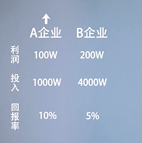
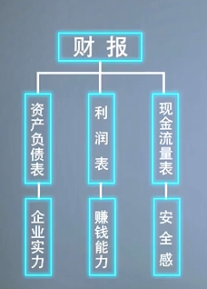
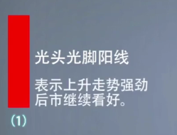
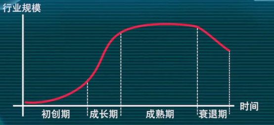

### 股票投资和炒股

- 股票投资：长期行为，众人一起把蛋糕做大的，分得更多的收益
- 炒股：短期的投机行为，固定大小的蛋糕，获得的回报是别人的资金， 7亏2平1赚

### 股票市场

- 一级市场: 直接对投资者发行股票筹集资金的市场
- 二级市场；相互转让股票的市场
- 上市公司：能在股票交易所挂牌交易的公司

### 股票的特点

- 股票投资不同偿还
- 股票具有高流动性
- 股票具有高收益性
- 股票具有高风险性
- 股票具有强参与性
- 股票权利永久有效

### 股票指数

股票价格指数

运用简单的统计方法编制而成用来反映市场总体价格或某类股票价格变动走势。

#### 上证指数

包含上交所的全部股票，反映上交所上市股票价格的整体变动情况

1990年12月19日，上证指数100点

#### 深圳指数

深圳综指，由深圳证券交易所编制其样本为所有在深圳证券交易所挂牌上市的股票

#### 深圳成指

深圳成分股指数，深成指，只选取了深交所部分股票，代表比较好一点的股票

#### 沪深300指数

2005年4月8日沪深交易所联合发布的第一只横跨两市的股票指数。

### 股票的分类

- 按照利润分配的先后顺序分类

	- 普通股：根据公司经营效率均等分配股东权益，目前在沪市和深市上市的股票都是普通股
	- 优先股：优先股的股东对公司资产利润分配享有优先权

- 按照股票的发行方式分类

	- A股：人民币普通股票，境内上市公司发行以人民币为货币进行交易的股票
	- B股：人民币特种股票，境内上市公司发行以人民币表明面值但用外币交易的股票，沪市用美元，深市用港币
	- H股：在中国大陆境内注册，而在香港上市交易的股票

- 按照上市公司所属的行业来划分

	- 金融板块，工业板块。。。

- 按照上市公司的经营业绩来划分

	- 蓝筹股：经营业绩较好，稳定性较高现金股利较丰厚的公司股票
	- 绩差股：指业绩较差的股票，这类股票价格往往表现不佳
	- ST股：Special Treatment，ST代表连续两年亏损
	- *ST股：连续三年亏损

。。。

### 预测股市的两个水晶球

#### 基本面分析理论, 价值投资流派

底层认知框架：坚实基础理论

坚实基础理论认为，每一个投资工具，无论是股票、债券还是房产，都有一个内在价值的坚实基础，我们通过仔细分析这个资产的现状和前景，就可以确定其内在价值，当市场价值低于做为坚实基础的内在价值时，买入机会就出现了，反之，卖出机会就出现了

#### 技术分析理论，趋势投资流派

底层认知框架：空中楼阁理论
 
空中楼阁理论认为，专业投资者不愿将精力用于估计企业的内在价值，第一是因为未来充满了不确定性，哪怕专业人士付出了巨大的劳动，企业的真是内在价值，也很难准确评估；第二，就算评估准确，现在股价被低估了，也不确定何时会回归价值。漫长的等待本身就充满了不确定性和风险，而聪明的投资者不会花更大的精力去研究企业的内在价值，而会花时间去研究其他投资者未来的投资行为，去分析他们在乐观时如何将自己的希望建成空中楼阁，聪明的投资者会估计出什么样的投资最容易被大众情绪堆积起一座空中楼阁，然后在大众开始行动之前，我现行买入，占据市场先机，坐等大家把股价推上去，最终建成空中楼阁

## 股票分析

### 基本面

对应坚实基础理论

- 宏观：
	
	- 股市的走势和变化由国家经济发展水平和经济的景气状态决定
	- 股价常被看作宏观经济的晴雨表
	- 利率：影响着公司融资的难度，国家上调利率，存款利率上升，人们愿意把钱存银行，就不太愿意去做风险更高的股票投资，这样一来就会有一部分资金，从股市里抽走，导致市场资金紧缺，就会对股价造成一定的负面影响，同时，由于利润上升，企业借钱的成本也提高了，意味着上市公司的经营成本上升了，利润相对就会减少，也是会导致股票价格有所下跌。
	
	

	- 通货膨胀：通货膨胀也会导致股市上涨，但是这是由于增发的货比导致的上涨，单纯撒钱，股市上涨是纯粹的泡沫，一旦发钱速度变慢了，不但股市要崩盘，实体经济也会产生连锁危机。

- 微观：
	- 公司的财务状况，市场竞争格局，经营管理体制等各方面情况影响着公司的股价。
	- 价值投资：股票长期投资价值的唯一决定因素，就是企业的基本面，基本面是企业增长的根本性的内生动力，每个价值投资者在选择股票做价值投资时，都需要去彻底的分析企业的基本面，企业存在的目的就是为了盈利，投资者最大的关注点也应该是在企业的盈利状况上，投资股票最大的目标就是应该去寻找那些最能够赚钱的企业，关键是将来也能继续赚大钱，而且赚的钱会越来越多，然后投资者以合理的或者低估的价格买入
	- 判断企业的赚钱能力：

		1. ROE（净资产收益率）

			- 公司税后利润除以净资产得到的百分比，指标值越高，说明投资收益越高，ROE越高，说明企业的赚钱能力越强，经营业绩越好。
			- 根据投资界供认的标准，一家公司如果常年的ROE保持在15%以上，就可以算是一个好学生了，如果ROE达到了20%以上，那基本上就是学霸级别了
			- ROE = 净利润 / 净资产
			- 净资产 = 总资产 - 总负债

			

		2. PE（市盈率）
			- 代表单位盈利投资者付出的代价有多高，市盈率就是需要多少年才能收回我们的投资
			- 用来衡量股价是被高估还是低估 
			- PE = 每股市价 / 每股净收益 
	
	- 财务状况：公司的总资产 = 所有者权益（股东投入的钱）+ 负债（公司向银行借的钱）
	- 负债经营：

		- 好处：放大经营杠杆，有减税作用
		- 坏处：降低企业的稳定性
		- 一般企业的资产负债率在40%-60%之间，是比较合理的

	- 企业活动；

		

		净现金流：一段时间内，企业经营，投资和融资活动的现金流入和流出的差额

		选择企业时，我们不光要求企业的现金流为正，更重要的是一定要求企业的经营现金流为正，如果一家企业的经营现金流为负数，代表一家企业自身的经营存在问题。**企业可以没有利润，但万万不能没有现金流 **
 
 - 中观分析

 	对企业所处的行业进行分析

	- 行业分析要素：

		- 行业是否具有周期性
			1. 强周期性行业：如钢铁、煤炭原材料行业，船舶机械、金融证券
			2. 弱周期性行业：食品、家电、娱乐、医药行业
		- 行业是否具有成长性：行业是否饱和

		- 生存环境是否激烈
		- 尽量选择产品和模式简单一眼就能看懂的公司

- 竞争分析

	- 核心竞争力
	- 企业优秀管理层
		- 诚信，敬业，社会责任
	- 财务报告：

		管理者定期向股东提交成绩单，报告公司的财务状况和经营成果，是了解企业的信息窗口

		

		1. 资产负债表：
			
			目前企业的可用资源

			- 资产：企业能有控制的预期会给企业带来收益的东西
			- 流动性资产：现金或者变现能力较强的资产
			- 非流动性资产：短期内不打算变现或者变现能力较差的资产
			- 应收账款：应收账款越多，企业话语权越低，有竞争力的企业通常表现为应收账款很少，甚至没有，而预收账款较多
			- 所有者权益
				- 实收资本：一般是指公司注册时的资本
				- 资本公积：企业在经营过程中由于接受捐赠、股本溢价以及法定财产重估增值等原因所形成的公积金
				- 本年利润：公司当年赚得的利润
				- 未分配利润：公司以前赚的利润还未来得及分红
			- 负债
				- 流动性负债：短期内需要还的负债
				- 非流动性负债
				- **流动比率 = 流动资产 / 流动负债**（最好大于200%）

		2. 利润表

			一段时间内企业利用资源带来回报的能力和效率

			- 经营利润：主业收入
				- 扣非净利润：扣除彩票中奖和炒股非日常收入和支出后的利润
				- 毛利率：

					- 毛利润占营业收入的百分比，其中毛利润为营业收入减去营业成本
					- 毛利率的比较主要是基于行业内和自身历史水平
					- 通常毛利率不能小于30%

				- 净利润：
					- 净利润 = 毛利润 - 三费 - 税费
					- 三费 = 销售费 + 管理费 + 财务费
						
			- 非经营利润：副业收入

		3. 现金流量表
			
			- 流动现金负债保障比率 = 流动现金 / 流动负债

				表明的是企业能否用一年内流动的现金来偿还一年内流动的债务，比率越高，说明有更多的流动资金来偿还流动债务

#### 财报3+1选股法

- 财报下载：
	- 巨潮资讯网: http://www.cninfo.com.cn/
	- 上交所官网：http://www.sse.com.cn/
	- 深交所官网：http://www.szse.cn/

- 杜邦分析法：

	- ROE = 净利率 * 总资产周转率 * 权益乘数
	- 总资产周转率：销售收入 / 总资产

		- 衡量资源的利用效率
		- 总资产周转率越高，公司运营能力越强，公司盈利能力越高

	- 权益乘数：资产 / 所有者权益

		- 权益乘数越高，所有者权益占比越低，资产负债率越高

- 3+1选股法：
	
	- 3代指杜邦分析法中ROE的三个指标
	- 1代指经营性现金流和净利润之比
	- 五个步骤：
		1. 净资产收益率：最近三年ROE在15%以上
		2. 净利率 / 毛利率：越高，公司盈利能力越强
		3. 总资产周转率：越高，公司能力越强
		4. 权益乘数：越低，负债率越低，公司越稳定
		5. 盈利质量：有很高的利润却没有相应的现金流，说明利润中水分较多

#### 神奇公式
	
《股市稳赚》作者：乔尔·格林布拉特

- 资产回报率 （相当于 ROE）
- 股票收益率 （相当于 1/PE）
- 原理：
	1. 按照ROE从高到底排序
	2. 按照PE从低到高排序
	3. 两者综合找出最佳组合（排名 = ROE的排名 + PE排名）
- 神奇公式的三个前提条件
	1. 深信并坚持长期投资
	2. 神奇公式不一定能保证每时每刻都有效，需要有耐心
	3. 调整自己的心里预期
- 实操：
	1. 打开东方财富网的PC端，点击左侧的**沪深**，将加权净资产收益率和市盈率添加进菜单栏
	2. 在股票部分点击右键，将数据导出致excel表格
	3. 导出属性包含，公司名称，股价，加权净资产收益率，市盈率
	4. 剔除名称以*ST、ST、PT、S开头的股票（亏损或即将退市）
	5. 剔除掉股价为横杠的股票
	6. 剔除加权净资产收益率和市盈率为负数的股票
	7. 按照ROE从高到低排序
	8. 按照PE从低到高排序
	9. 将两个排名相加找出前30只股票

### 技术面
对应空中楼阁理

- 量：成交量，成交量越多，市场越活跃
- 价：成交价
- 时：股票价格变化的时间周期
- 空：股票价格波动的空间范围

技术分析是基于三个理论假设成立的
	
- 假设一：股价变化涵盖一切市场信息
- 假设二：价格沿趋势移动
- 假设三：历史会重演

技术分析通过技术指标研究股票价格过去的运行轨迹，寻找股价未来变化方向的线索。

技术分析的工具

- K线：

	

	k线的几种形态：

	1. 光头光脚阳线

		

	2. 光脚阳线
		
		如果出现在高价区表示后市看跌

		

	3. 光头阳线
	
		

	4. 大阳线
	
		

	5. 小阳线
	
		

	6. 一字线

		

	7. 十字星线
	
		

- 两类投资者
	- 多头：看涨的人
	- 空头：看跌的人

- 趋势分析法

	股市按照一定规律运行，涨势或者跌势会延续，直到遇到阻力或者支撑改变其走势

	- 支撑线
	
		- 支撑位：在这个价位时，多方力量足够强大，价格开始反弹

	- 阻力线

		- 阻力位：在这个价位时，空房力量足够强大，价格开始下跌

	- 趋势线

	

	**问：如何利用支撑位和阻力位？**

	答：在支撑位买入，在阻力位卖出；在支撑位下设置一个止损价，如果股价反弹，保持不动，如果股价没有反弹，这时候就要清仓退场；当股价涨到阻力位时，卖出的同时，在阻力位上设置一个买单，如果股价跌了，保持不动，涨了买单启动自动购入一些。

- 移动平均线

	均线，英文MA，反应数据在时间窗口上的平均价格

- 技术分析的天敌

	- 存在交易费用
	- 交易者的心魔

- **为什么要了解技术分析？？ **

	- 技术分析能量化市场情绪，正确率比猜测要高一些。

### 消息面
对应空中楼阁理论

- 第一步：分辨消息

	- 第一种消息：庄家故意放假消息
	- 第二种消息：上市公司真有重大事件

- 第二步：判断消息的可信度

### 心理面
对应空中楼阁理论

- 偏见：在投资心理中，我们把一切让决策背离理性的因素都称之为偏见
- 认知偏见：信息获取或处理能力有限
- 情绪偏见：因执着或者自我保护产生偏见

## 行业选股

比较适合普通投资者选股

- 选股第一看行业

	1. 周期性
		- 周期性行业（取决于经济大环境）
			
			- 行业的景气度与外部宏观经济环境高度正相关，并呈现周期性循环的行业
			- 钢铁，造船，汽车，房地产，有色金属，银行。。。
			- 汽车，钢铁，机械，航空，建筑，军工

		- 非周期性行业（比较容易出牛股）

			- 医疗，消费品，环保，交通运输 
			- 医药，医疗器械，计算机软件，消费，休闲娱乐
			
		- 防御性行业
		
			- 粮油食品，公用事业

		**周期性行业适合波段操作，非周期性行业适合长期持有，防御性行业很难有超额收益**

	2. 生命周期

			

		- 初创期：

			行业前景广阔，市场需求不高，产品销量较低，企业引力较少

		- 成长期：

			产品更新迭代快，资本涌入多，增长具有确定性

		- 成熟期：

			市场份额占比稳定，产品价格较为稳定，增值服务增多，企业利润较为丰厚，风险相对更低

		- 衰退期：

			市场需求减少，产品销量下滑，企业利润降低

	3. 实操

		- 规避初创期衰退期企业
		- 成长性企业是最佳选择
		- 成熟期企业适合稳健性投资者
		- 选择自己更熟悉的行业
		
- 选股第二看公司

## 成长股投资

成长股企业特点：

- 处于朝阳行业
- 起步市值小
- 竞争优势强 

## 力哥原创指数选股法

- 第一步：挑选看好的行业
- 第二步：挑选行业指数中出现次数最多的成分股
- 第三步：选出来的个股进行交叉验证
- 第四步：通过财务分析筛选
- 第五步：判断估值的高低

