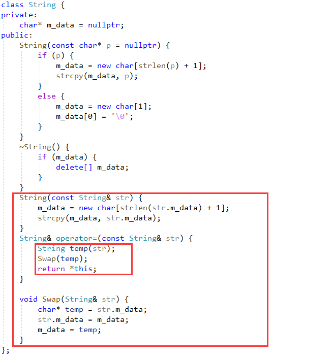

定义 operator= 时

需要考虑一个问题

把自己赋值给自己时怎么处理

当然类中包含指针的拷贝时才需要考虑这个情况

举个栗子

我们定义了一个 String 类

委托 `char *m_data` 来保存我们的数据

其定义像这样

```C++
class String {
private:
    char* m_data = nullptr;
public:
    String(const char* p = nullptr) {
        if (p) {
            m_data = new char[strlen(p) + 1];
            strcpy(m_data, p);
        }
        else {
            m_data = new char[1];
            m_data[0] = '\0';
        }
    }
    ~String() {
        if (m_data) {
            delete[] m_data;
        }
    }
    String(const String& str) {
        m_data = new char[strlen(str.m_data) + 1];
        strcpy(m_data, str.m_data);
    }
    String& operator=(const String& str) {
        if (&str == this) {
            return *this;
        }

        delete[] m_data;

        m_data = new char[strlen(str.m_data) + 1];
        strcpy(m_data, str.m_data);
        return *this;
    }
};
```


在 operator= 函数中需要做三件事

第一件事就是要判断传入的对象是不是自己

如果是自己直接就返回不需要拷贝

没有返回会引发什么情况呢

当执行第二步时把 m_data 给删掉了

第三步 strlen(str.m_data) 就会出现异常

第二件事也就是把拷贝之前的原本就有的数据删掉

有可能我在被赋值之前本身就有堆上的内存

不删掉就会有内存泄漏了

第三件事就是拷贝对象的内存数据

一个完整的拷贝赋值就完成了

所谓的 copy and swap 技术是什么呢

```C++
class String {
private:
    char* m_data = nullptr;
public:
    String(const char* p = nullptr) {
        if (p) {
            m_data = new char[strlen(p) + 1];
            strcpy(m_data, p);
        }
        else {
            m_data = new char[1];
            m_data[0] = '\0';
        }
    }
    ~String() {
        if (m_data) {
            delete[] m_data;
        }
    }
    String(const String& str) {
        m_data = new char[strlen(str.m_data) + 1];
        strcpy(m_data, str.m_data);
    }
    String& operator=(const String& str) {
        String temp(str);
        Swap(temp);
        return *this;
    }

    void Swap(String& str) {
        char* temp = str.m_data;
        str.m_data = m_data;
        m_data = temp;
    }
};
```



copy and swap 的实现如图所示

先利用传入的对象创建一个临时对象

再交换临时对象和自己的数据部分

这样就达到了拷贝的目的

至于 operator= 函数要做的三件事做到了吗

第一件事判断是不是自我赋值

这件事根本就不用做了

直接交换的情况下没必要判断是不是自己了

交换数据之后原来自己的数据给了临时对象

临时对象的数据被我拿过来了

第三件事也就完成了

在 operator=函数结束之后临时对象自动被析构

第二件事自动被做了

妥妥的工具人

好了

以上就是 copy and swap 技术的全部内容了

希望对大家有用


