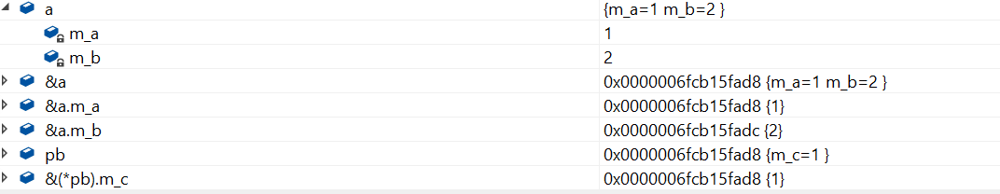

### 指针和引用的区别

1. 非空区别: 任何情况下都不能使用指向空值的引用，一个引用必须总是指向某些对象。 指针可以指向空。
2. 合法性区别: 引用在使用之前不需要测试合法性，指针应该总是要被测试，防止其为空
3. 可修改性区别: 引用在初始化时指定对象，以后不能修改。
4. 补充: 引用是对象的别名，声明一个引用并不分配内存，所有不能用引用声明一个数组


### 指针传递动态内存

**例1: 程序测试后会有什么结果？**

```cpp
#include<iostream>
#include<cstring>
using namespace std;

void getMemory(char*p, int num)
{
    p = (char*)malloc(sizeof(char) * num);
}

int main(int argc, const char* argv[])
{
    char *str = NULL;
    getMemory(str, 100);
    strcpy(str, "hello");
    return 0;
}
```

问题出现在`getMemory`里，编译器总是为函数的每个参数制作一个临时副本。在本题中，p为str的拷贝，p申请了一个新的内存空间，但是并没有影响到str，str还是NULL，再调用strcpy(), 则会使代码崩溃，并且p申请的内存也一直没用释放，造成内存泄露。

正确的方法是把往getMemory内传入str的地址。

```cpp
#include<iostream>
#include<cstring>
using namespace std;

void getMemory(char**p, int num)
{
    *p = (char*)malloc(sizeof(char) * num);
}

int main(int argc, const char* argv[])
{
    char *str = NULL;
    getMemory(&str, 100);
    strcpy(str, "hello");
    cout << str << endl;
    return 0;
}
```

不过这样写有些麻烦，我们可以直接把申请好的内存返回。

```cpp
#include<iostream>
#include<cstring>
using namespace std;

char* getMemory(int num)
{
    return (char*)malloc(sizeof(char) * num);
}

int main(int argc, const char* argv[])
{
    char *str = NULL;
    str = getMemory(100);
    strcpy(str, "hello");
    cout << str << endl;
    return 0;
}
```

**例2: 这个函数有什么问题?**

```cpp
char* strA()
{
    char str[] = "hello world";
    return str;
}
```

str里存的地址是函数strA栈帧里`"hello world"`的首地址，函数调用完成，临时空间被重置。

如果要获得正确的函数，可以这样写：

```c
char* strA()
{
    char *str = "hello world";
    return str;
}
```
首先要搞清楚`char str[]`, `char* str`, 

`char str[]` 分配的是一个局部数组，

`char* str` 分配的是一个指针遍历，

局部数组是局部变量，它对应的是内存中的栈。指针变量是全局变量，它对应的是内存中的全局区域。

不过上述代码只能c语言这么写，c++不允许

`ISO C++ forbids converting a string constant to ‘char*’`

这是因为C++字符串的字面值为 const char* 类型，则需要加上const （感谢左江的指正）

```cpp
const char* strA()
{
    const char *str = "hello world";
    return str;
}
```

把局部数组写成静态的，放在静态区，离开函数也不会被销毁，可以这么写：

```cpp
char* strA()
{
    static char str[] = "hello world";
    return str;
}
```

**例3: 下面代码的输出结果是什么？**

```cpp
#include<iostream>
using namespace std;

class A
{
public:
    A() { m_a = 1; m_b = 2; }
    ~A(){}
    void fun() { printf("%d%d", m_a, m_b);}
private:
    int m_a;
    int m_b;
};

class B
{
public:
    B() {m_c = 3;}
    ~B();
    void fun() {printf("%d", m_c);}
private:
    int m_c;
};


int main(int argc, const char* argv[])
{
    A a;
    B *pb = (B*)(&a);
    pb->fun();
    return 0;
}
```
这道题的目的就是考察你对内存偏移的理解，

`B* pb = (B*)(&a);`, 这是一个野蛮的转换，强制把a地址内容看成一个B类的对象，pb指向的是a类的内存空间, 把a类空间按照B类的结构来解读。




### 函数指针

**例1: 找出下列程序的错误**

```cpp
#include<iostream>
using namespace std;

int Max(int x, int y)
{
	return x > y ? x : y;
}

int main(int argc, char const *argv[])
{
	int *p = &Max;
	cout << p(2, 1) << endl;
	return 0;
}
```

这道程序提存在着函数指针的错误使用问题，正确的写法为: `int (*p)(int, int) = &Max;`


`int *p`	p 是int 型的指针

`int *p(int, int)`, p是一个函数，返回值为`int*`

`int (*p)(int, int)`, p是一个指针，指向函数的地址，函数的返回值为int


**例2: 下面的数据声明都代表什么？**

```cpp
float(**def)[10];
double*(*gh)[10];
double(*f[10])();
int*((*b)[10]);
long(*fun)(int)
int(*(*F)(int, int))(int)
```

答案如下:

```cpp
float(**def)[10];  // def是二级指针，指向一级指针，一级指针指向数组，数组的大小为10，数组元素类型为float
double*(*gh)[10];  // gh是一级指针，指向一个数组，数组大小为10，数组元素的类型为 double*
double(*f[10])();  // f是一个数组，数组大小为10，数组的元素类型为指针，指针指向的类型为 double() 的函数
int*((*b)[10]);  // b是一个指针，指向一个数组，数组的大小为10，数组元素的类型为int*
long(*fun)(int)  // fun是一个函数指针，指向 long(int) 型的函数
int(*(*F)(int, int))(int)  // F是一个指针，指向一个函数，函数的参数为(int, int), 函数的返回值是一个指针，指向一个函数，函数的参数为(int), 函数的返回值为int
```

### 指针数组和数组指针

**例1: 以下程序的输出是什么？**

```cpp
#include<iostream>
using namespace std;

int main(int argc, char const *argv[])
{
    int v[2][10] = {
        {1,2,3,4,5,6,7,8,9,10},
        {11,12,13,14,15,16,17,18,19,20},
    };
    int (*a)[10] = v;       // 数组指针是一个二级指针
    cout << a << endl;      // a是一个指针，指向 {1,2,3,4,5,6,7,8,9,10}
    cout << *a << endl;     // *a也是一个指针，指向 1 的地址
    cout << **a << endl;    // **a 取 1的值

    cout << a + 1 << endl;  // 指针向后偏移一个位置，这个位置的长度为指针所指容量的大小，偏移后指向 {11,12,13,14,15,16,17,18,19,20}
    cout << *(a + 1) << endl;  // 和*a的原理是一样的，指向11的地址
    cout << **(a + 1) << endl;  // 取11的值

    cout << *a + 1 << endl;  // *a指向1的地址，*a + 1, 指针向后偏移一个位置，*a指向的是int型的数据m, 向后偏移sizeof(int)，指向2
    cout << *(*a+1) << endl;  // 取2
    return 0;
}
```

**例2: 用变量a给出下面的定义**

1. 一个整型数。
2. 一个指向整型数的指针。
3. 一个指向指针的指针，它指向的指针是一个指向一个整型数
4. 一个有10个整型数的数组
5. 一个有10个指针的数组，该指针是指向一个整型数的
6. 一个指向有10个整型数数组的指针
7. 一个指向函数的指针，该函数有一个整型参数并返回一个整型数
8. 一个有10个指针的数组，该指针指向一个函数，该函数有一个整型参数并返回一个整型数

答案:

```cpp
// 1
int a;
// 2
int *a;
// 3
int **a;
// 4
int a[10];
// 5
int *a[10];
// 6
int (*a)[10];
// 7
int (*a)(int);
// 8
int (*a[10])(int);
```

**例3: 写出如下程序片段的输出**

```cpp
int a[] = {1,2,3,4,5};
int *ptr = (int*)(&a + 1);
printf("%d %d", *(a+1), *(ptr - 1));
```


答案：

```cpp
#include<iostream>
#include<cstdio>
using namespace std;

int main(int argc, char const *argv[])
{
    int a[] = {1,2,3,4,5};
    int *ptr = (int*)(&a + 1);

    cout << a << endl;  // 数组名的一个指向数组元素的常量指针
    cout << &a << endl;  // &a 并不是一个指向常量指针的指针，而是一个指向整个数组的指针

    // 以下两行验证以上的观点
    cout << a + 1 << endl;
    cout << &a + 1 << endl;

    // 所以 a + 1 指向2，*(a+1) 为2
    // &a + 1 应该指向5的下一个元素，ptr - 1 指向5
    printf("%d %d", *(a+1), *(ptr - 1));
    return 0;
}
```

### 迷途指针和野指针

*迷途指针*: 指针指向一个内存，这个内存会回收了，但是没有对这个指针做处理，没有将指针设为空

*野指针*: 声明了一个指针，没有将指针初始化。

**例1: 下面的程序输出结果是什么？**

```cpp
#include<iostream>
using namespace std;

int main(int argc, char const *argv[])
{
    char s1[] = "hello";
    char s2[] = "the";
    char s3[] = "world";
    char* a[] = {s1, s2, s3};
    char **pa = a;
    pa++;
    cout << *pa << endl;
    return 0;
}
```

a 是一个常量指针，指向数组的首地址，pa++, 向后挪一个指针大小，指向s2, 输出 "the"

### 指针和句柄

句柄是一个整数，是操作系统在内存中维护的一个对象，内存物理地址列表的整数索引，因为操作系统在内存管理时经常会将当前空闲对象的内存释放掉，当需要访问时再重新提交到物理内存，所以对象的物理地址是变化的，不允许程序直接通过物理地址来访问对象。 程序将想访问的对象的句柄传递给系统，系统根据句柄检索自己维护的对象列表就能知道程序想访问的对象及其物理地址了。

**句柄是一种指向指针的指针**。 我们知道，所谓指针是一种内存地址，应用程序启动后，组成这个程序的各对象是驻留在内存的。如果简单的理解，似乎我们只要知道内存的首地址，那么就可以随时用这个地址访问对象。 但是，如果真的这样认为，那么就大错特错了，我们知道，操作系统是一个以虚拟内存为基础的，存在换页现象，对象移动意味着它的地址变化了，如果地址总是变化，我们该怎么寻找对象呢？ 为了解决这个问题，操作系统为各应用程序腾出一些内存地址，用来专门登记各应用对象在内存中的地址变化，而登记的地址是不变的，操作系统移动对象后，将对象的地址告诉给句柄，通过句柄就能知道对象具体的位置了。

句柄--> 登记对象地址的地址 --> 对象的地址  --> 对象

程序每次重新启动，系统不保证分配给这个程序的句柄还是原来的句柄，就好比去电影院每次卖给我们的都不是同一个座位。


### this 指针

关于this指针，有这样一段描述: 当你进入一个房子后，你可以看见桌子，椅子，等，但是你看不到全貌了

对于一个类的实例来说，你可以看到成员函数，成员变量，但是实例本身呢？ this指针就是这样一个指针，时时刻刻指向实例本身

1. this 指针本质是一个函数参数，只是编译器隐藏起来的，语法层面的参数，实际上，成员函数默认第一个参数为 T* const this
2. this 在成员函数的开始前构造，结束后清除。 

`a.func(10);` 会被编译器编译成 `A::func(&a, 10);`, 看起来和静态函数没区别，不过，区别还是有的。 编译器通常会对this指针做一些优化，this指针的传递效率比较高，如VC通常是通过ecx寄存器传递。

3. this指针并不占用对象空间，this相当于非静态成员函数的一个隐含的参数，不占对象空间。
4. this指针存放在何处？ this指针会因编译器不同而有不同的位置，可能是堆，栈，也可能是寄存器。
5. this指针是如何传递给类中的函数的？ 大多数编译器是通过ecx寄存器传递this指针，事实上，这也是一个潜规则，一般来说，不同编译器都会遵从一致的传参原则，否则不同的编译器产生的obj就无法匹配了
6. 我们只有获得一个对象后，才能通过对象使用this指针，如果我们知道对象this的位置，可以直接使用吗？

this指针只有在成员函数中才有定义。 因此，你获得一个对象后，也不能通过对象使用this指针，只有在成员函数内才有this


