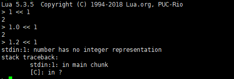
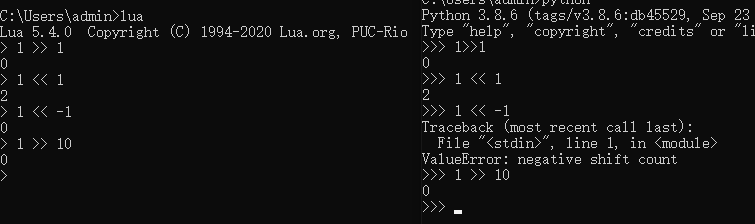
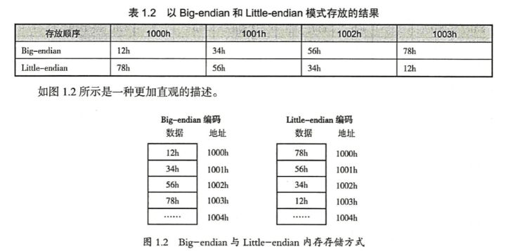
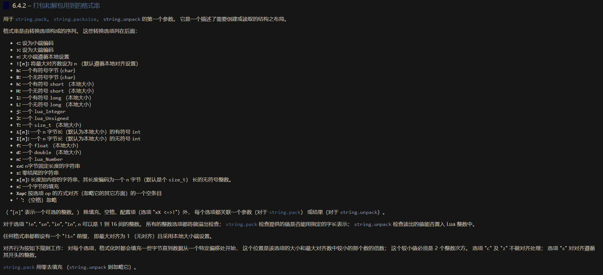

用lua工作有一段时间了，正好最近工作有点时间，再把lua参考手册过一遍，记录记录

<a href="lua5.3参考手册">https://cloudwu.github.io/lua53doc/manual.html#pdf-table.concat</a>

### number

number 类型可以表示为整数和浮点数，程序员大多数情况可以忽略整数和浮点数的差异(lua内)，因为lua内部会自动根据使用场景进行转换。

- 位操作: 总是将浮点数转换成整数

	

- 乘方和浮点除法总是将整数转换成浮点数。

	

- 数学操作若针对混合操作数 （整数和浮点数）将把整数转换为浮点数

当把一个整数转换为浮点数时， 若整数值恰好可以表示为一个浮点数，那就取那个浮点数。 否则，转换会取最接近的较大值或较小值来表示这个数。 这种转换是不会失败的。

将浮点数转为整数的过程会检查 浮点数能否被准确的表达为一个整数 （即，浮点数是一个整数值且在整数可以表达的区间）。 如果可以，结果就是那个数，否则转换失败。

=======
lua5.3以后，要求开发者更加显式地区分float和int，如string.format("%d", 1.2)会出现报错，而不是float-int自动转换为1；

在string.format中，整数可以自动转为浮点数，但是浮点数不能自动转为整数，会有报错。

--------------------------------------

### table

table 是一个关联数组， 也就是说，这个数组不仅仅以数字做索引，除了 nil 和 NaN 之外的所有 Lua 值 都可以做索引。


表是 Lua 中唯一的数据结构， 它可被用于表示普通数组、序列、符号表、集合、记录、图、树等等。 对于记录，Lua 使用域名作为索引。 语言提供了 a.name 这样的语法糖来替代 a["name"] 这种写法以方便记录这种结构的使用。

我们使用 *序列* 这个术语来表示一个用 {1..n} 的正整数集做索引的表。 这里的非负整数 n 被称为该序列的长度,  表 t 的长度只在表是一个 *序列* 时有定义,  序列指表的正数键集等于 {1..n} ， 其中 n 是一个非负整数。 在这种情况下，n 是表的长度。 
注意这样的表
```lua
{10, 20, nil, 40}
```
不是一个序列，因为它有键 4 却没有键 3。 （因此，该表的正整数键集不等于 {1..n} 集合，故而就不存在 n。） 

索引一张表的原则遵循语言中的直接比较规则。 当且仅当 i 与 j直接比较相等时 （即不通过元方法的比较）， 表达式 a[i] 与 a[j] 表示了表中相同的元素。 特别指出：一个可以完全表示为整数的浮点数和对应的整数相等 （例如：1.0 == 1）。 为了消除歧义，当一个可以完全表示为整数的浮点数做为键值时， 都会被转换为对应的整数储存。 例如，当你写 a[2.0] = true 时， 实际被插入表中的键是整数 2 。 

### \_ENV \_G

lua语言把所有的代码都当作匿名函数处理，例如

```lua
local z = 10
x = y + 10
```

实际上会被编译为

```lua
local _ENV = smoe value (也就是预定义上值，假设该值存在)
return function (...)
    local z = 10
    _ENV.x = _ENV.y + z
end
```

lua语言在编译运行时首先会创建一个默认环境（也称为“全局环境”，\_G表）并将其存储在注册表中。 <span style="color: red;">除非您将自定义环境（也就是自定义的\_ENV）传递给load或loadfile，否则此默认环境将用作所有块的\_ENV.</span>  lua\_pushglobaltable还直接从注册表中检索此全局环境，因此所有C模块都会自动使用它来访问全局变量。并且，如果标准的C模块已加载，则此默认的“全局环境”具有一个名为\_G的表字段，该表字段引用回全局环境。

简单的说就是首先lua会有一个\_G表,若没有人为的设置，则这个\_G表直接就被用作的\_ENV（而且所有的块都将以此\_ENV开头），然后\_ENV的里存储着一个键值对\_G = \_G（全局环境表）。任何对该环境的更改也将直接作用到\_G上，因为这两个初始时引用的同一个表，类似下面
<span style="color: red;">\_ENV不是全局环境，它指向的是当前环境，而Lua又确保每个chunk（可以是一句代码，函数体，do ...end之间的内容等）都以\_ENV开头，所以每个chunk中都可以拥有自己独立的环境。</span>
在每个环境中对非局部a的所有访问都转换为\_ENV.a。这种方式更安全，并且更加灵活，因为可以通过创建局部\_ENV变量来为单个代码块的创建单独的环境，从而降低块与块之间的耦合度。


```lua
print(_G) -- table: 0000021DC4BE6700
print(_ENV._G) -- table: 0000021DC4BE6700
```

当然我们可以创建自己的环境，并继承全局环境，但不改变全局环境

```lua
b = 25
_G = setmetatable(_G,{__newindex = function() print("can change this table") end})
a = 13 
local _ENV = setmetatable({},{__index = _G})
c = 14
print(a,b,c)
print(_G.a,_G.b,_G.c)
```

```
can change this table
nil	25	14
nil	25	nil
```

> load (chunk [, chunkname [, mode [, env]]])
> 加载一个代码块。

> 如果 chunk 是一个字符串，代码块指这个字符串。 如果 chunk 是一个函数， load 不断地调用它获取代码块的片断。 每次对 chunk 的调用都必须返回一个字符串紧紧连接在上次调用的返回串之后。 当返回空串、nil、或是不返回值时，都表示代码块结束。

> 如果没有语法错误， 则以函数形式返回编译好的代码块； 否则，返回 nil 加上错误消息。

> 如果结果函数有上值， env 被设为第一个上值。 若不提供此参数，将全局环境替代它。 所有其它上值初始化为 nil。 （当你加载主代码块时候，结果函数一定有且仅有一个上值 \_ENV 。 然而，如果你加载一个用函数创建出来的二进制代码块时，所有的上值都是新创建出来的。 也就是说它们不会和别的任何函数共享。

> chunkname 在错误消息和调试消息中，用于代码块的名字。 如果不提供此参数，它默认为字符串chunk 。 chunk 不是字符串时，则为 "=(load)" 。

> 字符串 mode 用于控制代码块是文本还是二进制（即预编译代码块）。 它可以是字符串 "b" （只能是二进制代码块）， "t" （只能是文本代码块）， 或 "bt" （可以是二进制也可以是文本）。 默认值为 "bt"。

> Lua 不会对二进制代码块做健壮性检查。 恶意构造一个二进制块有可能把解释器弄崩溃。


```lua
local _env = {print=_ENV.print, a=15}
local a = 12
local str = "print(a)"
load(str, "test", "t", _env)()
```

首先我们自定义了_ENV环境，并将其传给了load函数，所以load加载运行时的环境为我们自定义的_ENV环境，所以此时结果为15.

### 元表

lua 中只能改变表类型值的元表, 若想改变非表类型的值的元表, 需使用C PAI

元表决定了一个对象在数学运算、位运算、比较、连接、 取长度、调用、索引时的行为。 元表还可以定义一个函数，当表对象或用户数据对象在垃圾回收时调用。


### 垃圾收集

Lua 采用了自动内存管理。 这意味着你不用操心新创建的对象需要的内存如何分配出来， 也不用考虑在对象不再被使用后怎样释放它们所占用的内存。 Lua 运行了一个 垃圾收集器 来收集所有 死对象 （即在 Lua 中不可能再访问到的对象）来完成自动内存管理的工作。 Lua 中所有用到的内存，如：字符串、表、用户数据、函数、线程、 内部结构等，都服从自动管理。

Lua 实现了一个增量标记-扫描收集器。 它使用这两个数字来控制垃圾收集循环： 垃圾收集器间歇率 和 垃圾收集器步进倍率。 这两个数字都使用百分数为单位 （例如：值 100 在内部表示 1 ）。

垃圾收集器间歇率控制着收集器需要在开启新的循环前要等待多久。 增大这个值会减少收集器的积极性。 当这个值比 100 小的时候，收集器在开启新的循环前不会有等待。 设置这个值为 200 就会让收集器等到总内存使用量达到 之前的两倍时才开始新的循环。

垃圾收集器步进倍率控制着收集器运作速度相对于内存分配速度的倍率。 增大这个值不仅会让收集器更加积极，还会增加每个增量步骤的长度。 不要把这个值设得小于 100 ， 那样的话收集器就工作的太慢了以至于永远都干不完一个循环。 默认值是 200 ，这表示收集器以内存分配的“两倍”速工作。

如果你把步进倍率设为一个非常大的数字 （比你的程序可能用到的字节数还大 10% ）， 收集器的行为就像一个 stop-the-world 收集器。 接着你若把间歇率设为 200 ， 收集器的行为就和过去的 Lua 版本一样了： 每次 Lua 使用的内存翻倍时，就做一次完整的收集。

你可以通过在 C 中调用 lua_gc 或在 Lua 中调用 collectgarbage 来改变这俩数字。 这两个函数也可以用来直接控制收集器（例如停止它或重启它）。

> collectgarbage ([opt [, arg]])

> 这个函数是垃圾收集器的通用接口。 通过参数 opt 它提供了一组不同的功能：

- "collect": 做一次完整的垃圾收集循环。 这是默认选项。
- "stop": 停止垃圾收集器的运行。 在调用重启前，收集器只会因显式的调用运行。
- "restart": 重启垃圾收集器的自动运行。
- "count": 以 K 字节数为单位返回 Lua 使用的总内存数。 这个值有小数部分，所以只需要乘上 1024 就能得到 Lua 使用的准确字节数（除非溢出）。
- "step": 单步运行垃圾收集器。 步长“大小”由 arg 控制。 传入 0 时，收集器步进（不可分割的）一步。 传入非 0 值， 收集器收集相当于 Lua 分配这些多（K 字节）内存的工作。 如果收集器结束一个循环将返回 true 。
- "setpause": 将 arg 设为收集器的 间歇率 （参见 §2.5）。 返回 间歇率 的前一个值。
- "setstepmul": 将 arg 设为收集器的 步进倍率 （参见 §2.5）。 返回 步进倍率 的前一个值。
- "isrunning": 返回表示收集器是否在工作的布尔值 （即未被停止）。

#### 垃圾收集元方法

可以为表设定垃圾收集的元方法, 对于完全用户数据则需要使用 C API, *元表* 之前也说过了; 该元方法被称为终结器, 终结器可以配合 Lua 的垃圾收集器做一些额外的资源管理工作 （例如关闭文件、网络或数据库连接，或是释放一些你自己的内存）

要想让一个对象在收集过程中进入终结流程, 你必须标记它需要触发终结器; 当你为这个对象设置元表时, 若此刻这张元表中用一个以字符串"\_\_gc"为索引的域, 那么就标记了这个对象需要触发终结器; 

注意: 如果你给对象设置元表时,这个元表没有\_\_gc 域, 之后再给元表加上\_\_gc 域, 则标记失败; 一旦对象被标记, \_\_gc 域之后是可以修改的

```lua
-- 成功标记对象
local function test1( ... )
	local obj = setmetatable({}, {
		__gc = function()
			print('__gc 被调用, 可以做一些事情')
		end
	})

	obj.a = 1
	obj.b = 2
	print(obj.a)
	print(obj.b)
end

--[[ 输出

1
2
__gc 被调用, 可以做一些事情

]] 
```

```lua
-- 未能成功标记对象
local function test2( ... )
	local metatable = {}
	local obj = setmetatable({}, metatable)
	metatable.__gc = function()
		print('__gc 被调用, 可以做一些事情')
	end

	obj.a = 1
	obj.b = 2
	print(obj.a)
	print(obj.b)
end

--[[ 输出

1
2

]] 
```

```lua
-- 未能成功标记对象后修改__gc域
local function test3( ... )
	local metatable = {
		__gc = function()
				print('__gc 被调用, 可以做一些事情')
			end
	}
	local obj = setmetatable({}, metatable)
	metatable.__gc = function()
		print('__gc 被调用, 修改__gc域')
	end

	obj.a = 1
	obj.b = 2
	print(obj.a)
	print(obj.b)
end

--[[ 输出

1
2
__gc 被调用, 修改__gc域


]] 
```

当一个被标记的对象成为了垃圾后，垃圾收集器并不会立刻回收它。 取而代之的是，Lua 会将其置入一个链表。 在收集完成后，Lua 将遍历这个链表。 Lua 会检查每个链表中的对象的 \_\_gc 元方法：如果是一个函数，那么就以对象为唯一参数调用它； 否则直接忽略它。

在每次垃圾收集循环的最后阶段，本次循环中检测到需要被回收的对象，终结器的触发顺序将和标记循序相反，第一个调用的终结器为最后一个被标记的对象携带的那个; 每个终结器的运行可能发生在执行代码的任意时刻。

由于被回收的对象还需要被终结器使用， 该对象（以及仅能通过它访问到的其它对象）一定会被 Lua 复活。 通常，复活是短暂的，对象所属内存会在下一个垃圾收集循环释放。 然后，若终结器又将对象保存去一些全局的地方 （例如：放在一个全局变量里），这次复活就持续生效了。 此外，如果在终结器中对一个正进入终结流程的对象再次做一次标记让它触发终结器， 只要这个对象在下个循环中依旧不可达，它的终结函数还会再调用一次。 无论是哪种情况， 对象所属内存仅在垃圾收集循环中该对象不可达且 没有被标记成需要触发终结器才会被释放。

当你关闭一个状态机，Lua 将调用所有被标记了需要触发终结器对象的终结过程， 其次序为标记次序的逆序。 在这个过程中，任何终结器再次标记对象的行为都不会生效。

#### 弱表

弱表是一个表且拥有metatable元表，并在metatable中定义了__mode字段。

一张弱表可以有弱键或是弱值，也可以键值都是弱引用。 含有弱值的表允许收集器回收它的值，但会阻止收集器回收它的键。 若一张表的键值均为弱引用， 那么收集器可以回收其中的任意键和值。 任何情况下，只要键或值的任意一项被回收， 相关联的键值对都会从表中移除。 一张表的元表中的 \_\_mode 域控制着这张表的弱属性。 当 \_\_mode 域是一个包含字符 'k' 的字符串时，这张表的所有键皆为弱引用。 当 \_\_mode 域是一个包含字符 'v' 的字符串时，这张表的所有值皆为弱引用。

弱表中的引用是弱引用，弱引用不会导致对象引用计数变化。换言之，如果一个对象只有弱引用指向它，那么垃圾收集器会自动回收该对象所占用的内存空间。

下面是没有使用弱表的例子:

```lua
local tbl = {}

local key = {count = 100}
tbl[key] = 1

key = nil
print(tbl[key]) -- nil

-- 强制执行垃圾回收
collectgarbage("collect")

for k,v in pairs(tbl) do
    print(k, v, k.count)-- table: 00000000001a9b70   1   100
end
```

当把对象放入表中时就会产生一个引用，即使其他地方没有对表中的元素有任何引用，垃圾收集器也不会回收这些对象，你只能选择手动释放表元素或是将其常驻内存。

下面是使用了弱表:

```lua
local tbl = setmetatable({}, {__mode='k'})

local key = {count = 100}
tbl[key] = 1

key = nil
print(tbl[key]) -- nil

-- 强制执行垃圾回收
collectgarbage("collect")

for k,v in pairs(tbl) do
    print(k, v, k.count)
end
```

只输出一个nil，为`print(tbl[key]) -- nil` 输出，强制垃圾回收之后，key 表被回收，tbl表中的key:1 被移除，pairs 将遍历空表，则没有输出。

**应用案例**

使用“空间换时间”是一种通用的程序运行效率优化手段，例如对于一个普通的服务器，它接收到的请求中包含Lua代码，每当收到请求后都会调用Lua的`loadstring`函数来动态解析请求中的Lua代码，如果这种操作过于频繁，会直接导致服务器的执行效率下降。

要解决这个问题，可以将每次解析的结果缓存到一个table中，下次如果接收到相同的Lua代码则无需调用`loadstring`来动态解析，而是直接从table中获取并直接执行即可。这样，在有大量重复Lua代码的情况下，可极大地提高服务器的执行效率。反之，若有相当一部分的Lua代码只是出现一次，使用这种机制会导致大量的内存资源被占用而得不到有效的释放。在这种情况下，如果使用弱表，不仅仅可以在一定程序上提升程序的运行效率，内存资源也会得到有效的释放。

```lua
local result = {}
setmetatable( result, {__mode="v"} )

function mem_loadstring(str)
    local val = result[str]
    if val==nil then
        val = assert( loadstring( str ) )
        result[str] = val
    end
    return val
end
```

### 词法约定

Lua 语言对大小写敏感： and 是一个保留字，但 And 与 AND 则是两个不同的有效名字。 作为一个约定，程序应避免创建以下划线加一个或多个大写字母构成的名字 （例如 \_VERSION）。

转义串 '\z' 会忽略其后的一系列空白符，包括换行； 它在你需要对一个很长的字符串常量断行为多行并希望在每个新行保持缩进时非常有用。

字面串还可以用一种 长括号 括起来的方式定义。 我们把两个正的方括号间插入 n 个等号定义为 第 n 级开长括号。 就是说，0 级开的长括号写作 [[ ， 一级开长括号写作 [=[ ， 如此等等。 闭长括号也作类似定义； 举个例子，4 级反的长括号写作 ]====] 。 一个 长字面串 可以由任何一级的开长括号开始，而由第一个碰到的同级的闭长括号结束。 这种方式描述的字符串可以包含任何东西，当然特定级别的反长括号除外。 整个词法分析过程将不受分行限制，不处理任何转义符，并且忽略掉任何不同级别的长括号。 其中碰到的任何形式的换行串（回车、换行、回车加换行、换行加回车），都会被转换为单个换行符。

语句块是一个语句序列，它们会按次序执行：
```
	block ::= {stat}
Lua 支持 空语句， 你可以用分号分割语句，也可以以分号开始一个语句块， 或是连着写两个分号：

	stat ::= ‘;’
函数调用和赋值语句都可能以一个小括号打头， 这可能让 Lua 的语法产生歧义。 我们来看看下面的代码片断：

     a = b + c
     (print or io.write)('done')
从语法上说，可能有两种解释方式：

     a = b + c(print or io.write)('done')
     
     a = b + c; (print or io.write)('done')
当前的解析器总是用第一种结构来解析， 它会将开括号看成函数调用的参数传递开始处。 为了避免这种二义性， 在一条语句以小括号开头时，前面放一个分号是个好习惯：

     ;(print or io.write)('done')
一个语句块可以被显式的定界为单条语句：

	stat ::= do block end
显式的对一个块定界通常用来控制内部变量声明的作用域。 有时，显式定界也用于在一个语句块中间插入 return
```

在 repeat–until 循环中， 内部语句块的结束点不是在 until 这个关键字处， 它还包括了其后的条件表达式。 因此，条件表达式中可以使用循环内部语句块中的定义的局部变量。

return 只能被写在一个语句块的最后一句。 如果你真的需要从语句块的中间 return， 你可以使用显式的定义一个内部语句块， 一般写作 do return end。 可以这样写是因为现在 return 成了（内部）语句块的最后一句了。

函数调用和可变参数表达式都可以放在多重返回值中。 如果函数调用被当作一条语句（参见 §3.3.6）， 其返回值列表被调整为零个元素，即抛弃所有的返回值。 如果表达式被用于表达式列表的最后（或是唯一的）一个元素， 那么不会做任何调整（除非表达式被括号括起来）。 在其它情况下， Lua 都会把结果调整为一个元素置入表达式列表中， 即保留第一个结果而忽略之后的所有值，或是在没有结果时， 补单个 nil。

这里有一些例子：
```
f()                -- 调整为 0 个结果
g(f(), x)          -- f() 会被调整为一个结果
g(x, f())          -- g 收到 x 以及 f() 返回的所有结果
a,b,c = f(), x     -- f() 被调整为 1 个结果 （c 收到 nil）
a,b = ...          -- a 收到可变参数列表的第一个参数，
           	       -- b 收到第二个参数（如果可变参数列表中
           	       -- 没有实际的参数，a 和 b 都会收到 nil）

a,b,c = x, f()     -- f() 被调整为 2 个结果
a,b,c = f()        -- f() 被调整为 3 个结果
return f()         -- 返回 f() 的所有返回结果
return ...         -- 返回从可变参数列表中接收到的所有参数parameters
return x,y,f()     -- 返回 x, y, 以及 f() 的所有返回值
{f()}              -- 用 f() 的所有返回值创建一个列表
{...}              -- 用可变参数中的所有值创建一个列表
{f(), nil}         -- f() 被调整为一个结果
```
被括号括起来的表达式永远被当作一个值。 所以， (f(x,y,z)) 即使 f 返回多个值， 这个表达式永远是一个单一值。 （(f(x,y,z)) 的值是 f 返回的第一个值。 如果 f 不返回值的话，那么它的值就是 nil 。）

------------------------------------------------------------

对于右移和左移，均用零来填补空位。 

移动的位数若为负，则向反方向位移； <span style="color: red;">(这和python的直接报错不一样)</span>

若移动的位数的绝对值大于等于 整数本身的位数，其结果为零 （所有位都被移出）。



若移动的位数的绝对值大于等于 整数本身的位数，其结果为零 （所有位都被移出）。

-------------------------

等于操作 （==）先比较操作数的类型。 如果类型不同，结果就是 false。 

否则，继续比较值。 字符串按一般的方式比较。 

数字遵循二元操作的规则： 如果两个操作数都是整数， 它们按整数比较； 

否则，它们先转换为浮点数，然后再做比较。

--------------------------

return functioncall 这样的调用形式将触发一次 尾调用。 Lua 实现了 完全尾调用（或称为 完全尾递归）： 在尾调用中， 被调用的函数重用调用它的函数的堆栈项。 因此，对于程序执行的嵌套尾调用的层数是没有限制的。 然而，尾调用将删除调用它的函数的任何调试信息。 注意，尾调用只发生在特定的语法下， 仅当 return 只有单一函数调用作为参数时才发生尾调用； 这种语法使得调用函数的所有结果可以完整地返回。 因此，下面这些例子都不是尾调用：

```lua
return (f(x))        -- 返回值被调整为一个
return 2 * f(x)
return x, f(x)       -- 追加若干返回值
f(x); return         -- 返回值全部被舍弃
return x or f(x)     -- 返回值被调整为一个
```

------------------------------------
```
该语句

     function f () body end
被转译成

     f = function () body end
该语句

     function t.a.b.c.f () body end
被转译成

     t.a.b.c.f = function () body end
该语句

     local function f () body end
被转译成

     local f; f = function () body end
而不是

     local f = function () body end
（这个差别只在函数体内需要引用 f 时才有。）
```

----------------------

每次执行到一个 local 语句都会定义出一个新的局部变量。 看看这样一个例子：
```
a = {}
local x = 20
for i=1,10 do
	local y = 0
	a[i] = function () y=y+1; return x+y end
end
```
这个循环创建了十个闭包（这指十个匿名函数的实例）。 这些闭包中的每一个都使用了不同的 y 变量， 而它们又共享了同一份 x。


### 基础函数

> assert (v [, message])

如果其参数 v 的值为假（nil 或 false）， 它就调用 error； 否则，返回所有的参数。 在错误情况时， message 指那个错误对象； 如果不提供这个参数，参数默认为 "assertion failed!" 。

> getmetatable (object)

如果 object 不包含元表，返回 nil 。 否则，**如果在该对象的元表中有 "\_\_metatable" 域时返回其关联值**， 没有时返回该对象的元表。

> next (table [, index])

第一个参数是要遍历的表，第二个参数是表中的某个键。 next 返回该键的下一个键及其关联的值。

如果用 nil 作为第二个参数调用 next 将返回初始键及其关联值。 当以最后一个键去调用，或是以 nil 调用一张空表时， next 返回 nil。

```
assert(next({}) == nil)
```

当在遍历过程中你给表中并不存在的域赋值， next 的行为是未定义的

> print (···)

接收任意数量的参数，并将它们的值打印到 stdout。 它用 tostring 函数将每个参数都转换为字符串。 

print 不用于做格式化输出。仅作为看一下某个值的快捷方式。 多用于调试。 完整的对输出的控制，请使用 string.format 以及 io.write。

> rawequal (v1, v2)

在不触发任何元方法的情况下 检查 v1 是否和 v2 相等。 返回一个布尔量。

> rawget (table, index)

在不触发任何元方法的情况下 获取 table[index] 的值。 table 必须是一张表； index 可以是任何值。

> rawlen (v)

在不触发任何元方法的情况下 返回对象 v 的长度。 v 可以是表或字符串。 它返回一个整数。

> rawset (table, index, value)

在不触发任何元方法的情况下 将 table[index] 设为 value。 table 必须是一张表， index 可以是 nil 与 NaN 之外的任何值。 value 可以是任何 Lua 值。
这个函数返回 table。

> select (index, ···)

select 详解看这里: http://yiouejv.com/lua/select%E5%87%BD%E6%95%B0/

> tonumber (e [, base])

如果调用的时候没有 base， tonumber 尝试把参数转换为一个数字。 如果参数已经是一个数字，或是一个可以转换为数字的字符串， tonumber 就返回这个数字； 否则返回 nil。

字符串的转换结果可能是整数也可能是浮点数， 这取决于 Lua 的转换文法, （字符串可以有前置和后置的空格，可以带符号。）

当传入 base 调用它时， e 必须是一个以该进制表示的整数字符串。 进制可以是 2 到 36 （包含 2 和 36）之间的任何整数。 大于 10 进制时，字母 'A' （大小写均可）表示 10 ， 'B' 表示 11，依次到 'Z' 表示 35 。 如果字符串 e 不是该进制下的合法数字， 函数返回 nil。

> tostring (v)

可以接收任何类型，它将其转换为人可阅读的字符串形式。 浮点数总被转换为浮点数的表现形式（小数点形式或是指数形式）。 （如果想完全控制数字如何被转换，可以使用 string.format。）

如果 v 有 "\_\_tostring" 域的元表， tostring 会以 v 为参数调用它。 并用它的结果作为返回值。

### 模块

文档很详细

https://cloudwu.github.io/lua53doc/manual.html#6.3

### 大端序和小端序

- Big-endian：高位字节存入低地址，低位字节存入高地址
- Little-endian：低位字节存入低地址，高位字节存入高地址

例如，将12345678h写入1000h开始的内存中，以大端序和小端序模式存放结果如下



字节序通常只和你使用的处理器架构有关，而和编程语言无关，比如常见的Intel x86系列就是小端序。

> string.pack (fmt, v1, v2, ···)

返回一个打包了（即以二进制形式序列化） v1, v2 等值的二进制字符串。 字符串 fmt 为打包格式

> string.unpack (fmt, s [, pos])

返回以格式 fmt 打包在字符串 s （参见 string.pack） 中的值。 选项 pos（默认为 1 ）标记了从 s 中哪里开始读起。 读完所有的值后，函数返回 s 中第一个未读字节的位置。




