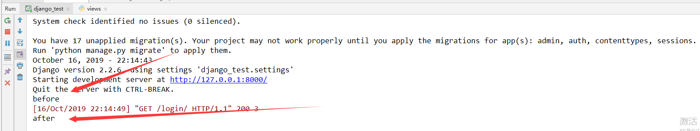

# django视图之CBV的基本使用

## CBV 和 FBV 是什么？

### CBV: class base view

​	基于类的视图

### FBV: function base view

​	基于函数的视图

我们在django基础中说到路由匹配是匹配到对应的函数，然后返回该函数对应的结果，而不是class。针对这个问题，django提供了一个类，我们写的类视图只需要继承这个类i，django就自动帮我实现http请求和类方面映射关系。

### 类视图的用法

在`urls.py`中定义路由规则（这里使用django 2.2 以上的版本）

```python
from .views import LoginView
urlpatterns = [
    path('login/', LoginView.as_view())
]
```

在`views.py`中编写类视图

```python
from django.http import HttpResponse
from django.views import View

class LoginView(View):
	def get(self, request, *args, **kwargs):
		return HttpResponse('GET')

	def post(self, request, *args, **kwargs):
		return HttpResponse('POST')

```

不同的http请求方式去http://127.0.0.1:8000/login/ 就会执行类视图中对应的方法。

##### 路由分发怎么做到的呢？

​	匹配到路由之后，首先执行`LoginView.as_view(`) 方法， LoginView类不存在`as_view()` 方法，去父类找，父类（View）的as_view()源码如下：

```python
class View:
    """
    Intentionally simple parent class for all views. Only implements
    dispatch-by-method and simple sanity checking.
    """

    http_method_names = ['get', 'post', 'put', 'patch', 'delete', 'head', 'options', 'trace']

    def __init__(self, **kwargs):
        """
        Constructor. Called in the URLconf; can contain helpful extra
        keyword arguments, and other things.
        """
        # Go through keyword arguments, and either save their values to our
        # instance, or raise an error.
        for key, value in kwargs.items():
            setattr(self, key, value)

    @classonlymethod
    def as_view(cls, **initkwargs):
        """Main entry point for a request-response process."""
        for key in initkwargs:
            if key in cls.http_method_names:
                raise TypeError("You tried to pass in the %s method name as a "
                                "keyword argument to %s(). Don't do that."
                                % (key, cls.__name__))
            if not hasattr(cls, key):
                raise TypeError("%s() received an invalid keyword %r. as_view "
                                "only accepts arguments that are already "
                                "attributes of the class." % (cls.__name__, key))

        def view(request, *args, **kwargs):
            self = cls(**initkwargs)
            if hasattr(self, 'get') and not hasattr(self, 'head'):
                self.head = self.get
            self.setup(request, *args, **kwargs)
            if not hasattr(self, 'request'):
                raise AttributeError(
                    "%s instance has no 'request' attribute. Did you override "
                    "setup() and forget to call super()?" % cls.__name__
                )
            return self.dispatch(request, *args, **kwargs)
        view.view_class = cls
        view.view_initkwargs = initkwargs

        # take name and docstring from class
        update_wrapper(view, cls, updated=())

        # and possible attributes set by decorators
        # like csrf_exempt from dispatch
        update_wrapper(view, cls.dispatch, assigned=())
        return view
```

看源码可以看出，`as_view()`方法

1.  如果请求的方法没在`http_method_names`中，则会抛出异常 。

2. 又定义了一个函数`view`, `self = cls(**initkwargs) `等价于 `self = LoginView(**initkwargs)`, 随后进行了一些属性绑定`self.setup(request, *args, **kwargs)`，再判断了self对象有没有request属性。

   **重点:调用self.dispatch(request, *args, ** **kwargs)** 方法。

   ```python
   def dispatch(self, request, *args, **kwargs):
       # Try to dispatch to the right method; if a method doesn't exist,
       # defer to the error handler. Also defer to the error handler if the
       # request method isn't on the approved list.
       if request.method.lower() in self.http_method_names:
           handler = getattr(self, request.method.lower(), self.http_method_not_allowed)
       else:
           handler = self.http_method_not_allowed
       return handler(request, *args, **kwargs)
   ```

   从LoginView的request中获取请求方式， 如果request.method存在于http_method_names中，则使用getattr反射的方式来得到handler，再执行CBV中的方法并返回。

   **由此，可以知道如果在Django项目中使用CBV的模式，实际上调用了getattr的方式来执行获取类中的请求方法对应的函数**

## 自定义dispatch方法

由上述的分析可知，任务cbv在执行代码前都会执行dispatch方法，所以dispatch可以当勾子使用，可以在请求url时在`dispatch`中定义一些行为。

```python
from django.http import HttpResponse
from django.views import View


class LoginView(View):
    def dispatch(self, request, *args, **kwargs):
        print('before')
        ret = super(LoginView, self).dispatch(request, *args, **kwargs)
        print('after')
        return ret

    def get(self, request, *args, **kwargs):
        return HttpResponse('GET')

    def post(self, request, *args, **kwargs):
        return HttpResponse('GET')
```

