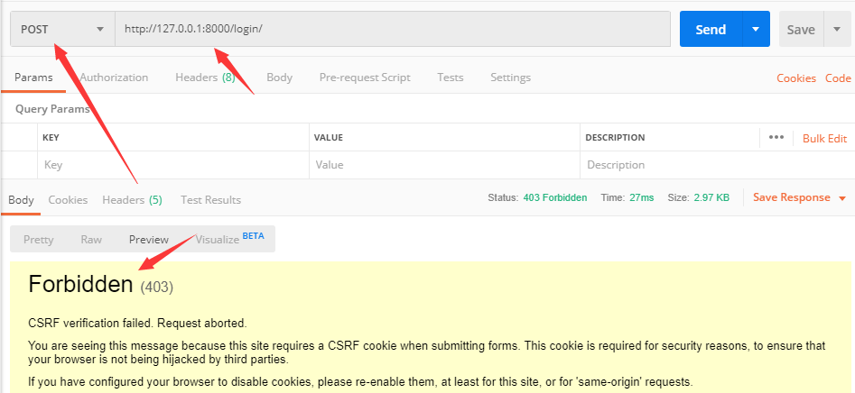

# CBV中解决csrf认证的问题

## CSRF（cross site request  forgery）跨站请求伪造

具体是利用什么攻击的可以看看百度百科：[csrf百科](https://baike.baidu.com/item/CSRF/2735433?fr=aladdin)

**防御：**服务器给客户端发送一个随机的字符串，客户端和服务器交互的时候需要带上这个字符串，否则就是违法的用户，因为每次字符串都是随机的，从而避免了黑客利用的风险。

## django是防御csrf的？

django默认全局开启csrf认证，只要是post请求就必须带上csrf的字符串。

在`setting.py`中设置中间件。`django.middleware.csrf.CsrfViewMiddleware`

```python
MIDDLEWARE = [
    'django.middleware.security.SecurityMiddleware',
    'django.contrib.sessions.middleware.SessionMiddleware',
    'django.middleware.common.CommonMiddleware',
    'django.middleware.csrf.CsrfViewMiddleware',  # 全局开启
    'django.contrib.auth.middleware.AuthenticationMiddleware',
    'django.contrib.messages.middleware.MessageMiddleware',
    'django.middleware.clickjacking.XFrameOptionsMiddleware',
]
```

也可以把中间件注释掉，就全局关闭了，但是存在被利用漏洞的风险。

### 开启csrf验证发送post未带随机字符串



### ajax提交post请求 

1. 在网页中任意一个位置增加  

   在模板中增加了  后，前端模板中会生成一个input标签。就是下面这样

   ```html
   <input type="hidden" name="csrfmiddlewaretoken" value="YcT8OPwJxCzwyspr0zDeoU6jSBv65EbhT5oBf2LMV603Qs2joTROB6YIlHvV6E4K">
   ```

2. 在ajax post请求中提交参数时，需要将csrf的键和值也提交给服务器。

   把随机字符串设置到请求头里。jquery示例。

   ```js
   var csrftoken = $('input[name=csrfmiddlewaretoken]').attr('value');
   xhr.setRequestHeader("X-CSRFtoken", csrftoken);
   ```

### 全局开启了，怎么让单个视图函数不开启csrf保护呢？

#### 装饰器

```python
# 关闭csrf保护
from django.views.decorators.csrf import csrf_exempt
# 开启csrf保护
from django.views.decorators.csrf import csrf_protect
```

#### FBV

​	只需要在需要开启/关闭的函数上使用装饰器。

#### CBV

​	需要借助`method_decorator`装饰器

```python
from django.utils.decorators import method_decorator
```

1. 方式一：在dispatch方法上使用装饰器

   ```python
   from django.views.decorators.csrf import csrf_exempt, csrf_protect
   from django.utils.decorators import method_decorator
   
   class StutentsView(View):
       method_descrator(csrf_exempt)
       def dispatch(csrf_exempt):
           return super(StudentsView, self).dispatch(request, *args, **kwargs)
   
       def get(self, request, *args, **kwargs):
           return HttpResponse('GET')
   ```

   

2. 方式二：在类上使用装饰器

   ```python
   from django.views.decorators.csrf import csrf_exempt, csrf_protect
   from django.utils.decorators import method_decorator
   
   @method_decorator(csrf_exempt, name="dispatch")
   class StutentsView(View):
       def get(self, request, *args, **kwargs):
           return HttpResponse('GET')
   ```

